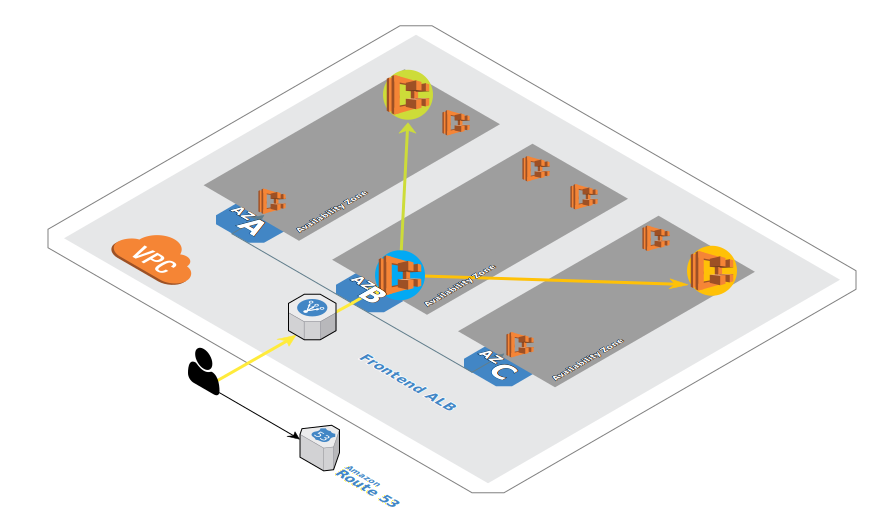

# Your EKS Challenge

## Setup your Cloud9 Environment

* Return to your Cloud9 workspace and click the gear icon (in top right corner)
* Select AWS SETTINGS
* Turn off AWS managed temporary credentials
* Close the Preferences tab


A new Terminal could be opened by using **Window** > **New Terminal** from the menu

Visit https://docs.aws.amazon.com/console/cloud9/ for our documentation.

---

## Environment

### ! All the required templates we used to create the Cluster are stored inside the **eks/eks-templates** folder ! ###
&#160;
&#160;
&#160;
&#160;

We created an EKS Cluster ${PROJECT_ID} with a NodeGroup attached. On top of that Cluster we deployed three applications

* ecsdemo-frontend: Our Frontend Application
* ecsdemo-nodejs: NodeJS Backend API
* ecsdemo-crystal: Crystal Backend API

The frontend could be accessed by open the [Frontend Service](http://${FRONTEND_SERVICE}/)



You goal should be to show the Frontend Service Page when accessing the [Frontend Service](http://${FRONTEND_SERVICE}/) and seeing that traffic is going from and to each of the three AZ

### Environment Parameters

|Parameter|Value|
|:-------|:-------|
|Cluster Name|${PROJECT_ID}|
|Region|${AWS_REGION}|
|Frontend Service|http://${FRONTEND_SERVICE}/|
|EKS Encryption Key ARN|${MASTER_ARN}|
|Kubernetes Developer Role|${K8_DEV_ROLE_ARN}|
|Kubernetes Developer Group|${K8_DEV_GROUP_ARN}|
|Kubernetes Developer User|${K8_DEV_USERNAME}|
|Kubernetes Developer User Credentials File|eks/${K8_DEV_USERNAME}-credentials.json|


---

## Mission 1

One of your colleagues did some miss-configuration and now the Frontend didn't shows up. Try to get it back to work!

<details>
<summary>Hint - Find the root cause (Part 1)</summary>
<p>

When using 

```bash
    kubectl get nodes
```

you will get shown that the node displayed as **NotReady**

</p>
</details>

<details>
<summary>Hint - Find the root cause (Part 2)</summary>
<p>


While diving deeper, we check the Nodegroup by

```bash
     aws eks describe-nodegroup --cluster-name ${PROJECT_ID} --nodegroup nodegroup
```

Leading us to the healt status message *"Your worker nodes do not have access to the cluster. Verify if the node instance role is present and correctly configured in the aws-auth ConfigMap."*

Looking into eks-templates/eks-auth-cn.yaml you will see that the Role-Name doesn't match the Instance Node Name and so there is no control to the nodes

</p>
</details>

<details>
<summary>Hint - Fix it (Part 1)</summary>
<p>

You have to change the IAM Role in eks-templates/eks-auth-cn.yaml to the existing role by removing the trailing _easteregg

Update the configmap with the new authorization template

```bash
    eksctl apply -f eks-auth-cn.yaml
```

</p>
</details>

<details>
<summary>Hint - Fix it (Part 2)</summary>
<p>

Node are still in a NotReady State? Don't forget to upgrade the Cluster to get the new NodeGroup Health State!

```bash
    eksctl upgrade cluster --name ${PROJECT_ID} --approve
```

</p>
</details>


---

## Mission 2

As you fixed the first issue it seems that our environment is not scaled properly over all the three AZ!

<details>
<summary>Hint - Find the root cause</summary>
<p>

By using

```bash
    kubectl get nodes
```

you will see that there is only one node!

```bash
     aws eks describe-nodegroup --cluster-name ${PROJECT_ID} --nodegroup nodegroup
```

Gives us more information, the Min - Max - Desired Size of the NodeGroup is only 1 Node.

</p>
</details>

<details>
<summary>Hint - Fix it (Part 1)</summary>
<p>

Change the number of desired nodes to 3 in the **eks/eks-templates/eks-cluster.yaml** template and apply the changes
**OR**
Update the desired size through the AWS Console

</p>
</details>

<details>
<summary>Hint - Fix it (Part 2)</summary>
<p>

When you decide to change it through eksctl

* Drain the existing Nodes
* Delete the existing NodeGroup 
* Make sure by using *aws eks list-nodegroups --cluster-name ${PROJECT_ID}* that the NodeGroup got deleted before proceed
* Re-Create the NodeGroup with the new maximum size of Nodes
* Up-Scale the NodeGroup to the desired size of 3 Nodes

```bash
    eksctl drain nodegroup --cluster ${PROJECT_ID} --name nodegroup
    eksctl delete nodegroup --cluster ${PROJECT_ID} --name nodegroup
    eksctl create nodegroup -f eks-cluster-compiled.yaml
    eksctl scale nodegroup --cluster=${PROJECT_ID} --nodes=3 --name=nodegroup
```

</p>
</details>

<details>
<summary>Hint - Fix it (Part 3)</summary>
<p>

Finally don't forget to scale up the replicas of the deployments!

```bash
    kubectl scale deployment ecsdemo-nodejs --replicas=3
    kubectl scale deployment ecsdemo-crystal --replicas=3
    kubectl scale deployment ecsdemo-frontend --replicas=3
```

</p>
</details>

---

## Mission 3

The Frontend Service seems to run again. To prevent such a failure in future we want to create two Namespaces

* integration
* development

and add the Development User **${K8_DEV_USERNAME}** to the development namespace.

Check the provided eks/eks-templates/eks-rolebinding.yaml


<details>
<summary>Hint 1</summary>
<p>

Create **integration** and **development** namspace

```bash
    kubectl create namespace integration
    kubectl create namespace development
```

and double check that they are created

```bash
    kubectl get namespace
```

</p>
</details>

<details>
<summary>Hint 2</summary>
<p>

Apply the provided rolebinding configuration to the **development** namespace

```bash
    kubectl apple -f eks-rolebinding.yaml -n development
```

</p>
</details>

<details>
<summary>Hint 2</summary>
<p>

Apply the provided rolebinding configuration to the **development** namespace

```bash
    kubectl apple -f eks-rolebinding.yaml -n development
```

</p>
</details>

<details>
<summary>Hint 3</summary>
<p>

Get the current Account Id

```bash
    aws sts get-caller-identity
```

```bash
    eksctl create iamidentitymapping \
    --cluster ${PROJECT_ID} \
    --arn ${K8_DEV_ROLE_ARN} \
    --username dev-user
```

Double check that there is a mapping from the iam user to the iam role with

```bash
    eksctl get iamidentitymapping --cluster ${PROJECT_ID}
```

</p>
</details>
<p></p>
<p></p>
<p></p>
<p></p>

## Test the Mission
<p></p>
<p></p>

**Add in ~/.aws/config**
```bash
mkdir -p ~/.aws

cat << EoF >> ~/.aws/config
[profile dev]
role_arn=${K8_DEV_ROLE_ARN}
source_profile=eksDev

EoF
```

**Add in ~/.aws/credentials**
```bash
cat << EoF >> ~/.aws/credentials

[eksDev]
aws_access_key_id=$(jq -r .AccessKey.AccessKeyId /home/ec2-user/environment/eks/${K8_DEV_USERNAME}-credentials.json)
aws_secret_access_key=$(jq -r .AccessKey.SecretAccessKey /home/ec2-user/environment/eks/${K8_DEV_USERNAME}-credentials.json)

EoF
```

**Test it with the dev profile**

```bash
aws sts get-caller-identity --profile dev
```

**Create the Kubectl Config File for dev**

```bash
export KUBECONFIG=/tmp/kubeconfig-dev && eksctl utils write-kubeconfig ${PROJECT_ID}
cat $KUBECONFIG | yq e '.users.[].user.exec.args += ["--profile", "dev"]' - -- | sed 's/${PROJECT_ID}./${PROJECT_ID}-dev./g' | sponge $KUBECONFIG
```
